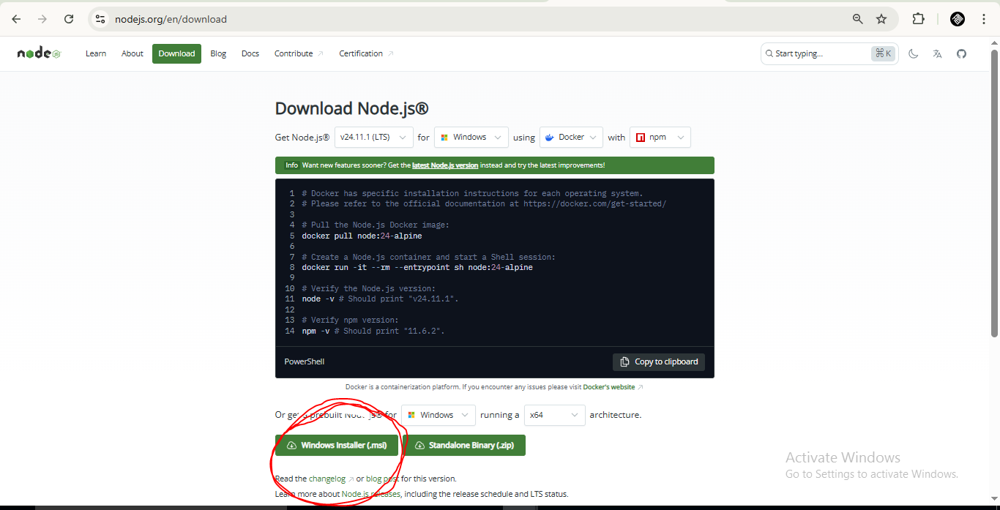

# Project README

**Simple CRUD with Firebase Realtime Database — Full setup guide**

This `README.md` walks you step-by-step from creating a Firebase project to installing Node.js and local tooling, configuring environment variables, and running the example CRUD project (HTML + JS + Firebase Realtime DB). It’s aimed at beginners and includes secure handling for your Firebase keys.

---

## Table of contents

1. Prerequisites
2. Create a Firebase project & enable Realtime Database
3. Download and install Node.js (and restart)
4. Install recommended tools (VS Code, Git, live server)
5. Project files and structure
6. Configuring environment variables (secure keys)
7. Running the app locally
8. Optional: Deploying to Firebase Hosting
9. Troubleshooting & tips
10. Security notes

---

## 1) Prerequisites

- A computer (Windows / macOS / Linux)
- Internet connection
- Basic command-line familiarity (Terminal / Command Prompt / PowerShell)

---

## 2) Create a Firebase project & enable Realtime Database

1. Open https://console.firebase.google.com and sign in with your Google account.
2. Click **Add project** → enter a project name (e.g. `ueproommonitoring-dev`) → continue.
3. (Optional) Disable Google Analytics for this project if not needed.
4. Once the project is created, go to **Build → Realtime Database** in the left menu.
5. Click **Create database** and choose a location close to you.
6. Start in **Locked mode** (recommended). For development you can use **Test mode** temporarily but set rules before publishing.

### Get your Web SDK configuration (the `firebaseConfig`):
1. In the Firebase console click the gear (⚙️) icon → **Project settings**.
2. Under **Your apps**, click the `</>` (web) icon to register a new web app.
3. Give it a nickname (e.g. `crud-web`) and register. You will see the **Firebase SDK config** snippet (apiKey, authDomain, databaseURL, etc.).
4. **Do NOT commit these raw keys to public repos**. We'll secure them in the next steps.

---

## 3) Download and install Node.js (and restart)

> Node.js is used for local dev tooling (dev server, optional build steps, environment variables). We will use npm (bundled with Node).

### Windows / macOS / Linux (recommended method)

1. Visit https://nodejs.org/en/download/ and download the **LTS installer** for your OS.

### 📸 Screenshot (Node.js download page)
> **Insert your screenshot below:**
```

```

2. Run the installer and follow instructions.
3. Verify installation in a terminal:


```bash
node -v
npm -v
```

4. **Restart your computer** after installation (recommended on Windows/macOS) to ensure environment variables are available system-wide.

---

## 4) Install recommended tools

- **VS Code** — https://code.visualstudio.com/
- **Git** — https://git-scm.com/ (optional but recommended)
- **live-server** or **http-server** for quick static hosting

Install `live-server` globally for a quick local dev server (optional):

```bash
npm install -g live-server
```

Or use the VS Code Live Server extension.

---

## 5) Project files and structure

Example structure used by this tutorial:

```
/project-root
  ├─ index.html
  ├─ style.css
  ├─ js/
  │   ├─ firebaseConfig.js      # exports `db` OR reads config from env safely
  │   └─ crud.js
  ├─ .env.example
  ├─ package.json
  └─ README.md
```

### Example `index.html`
- Simple input field + `div` that shows cards (records)
- Loads `js/crud.js` with `type="module"`

---

## 6) Configuring environment variables (secure keys)

> **Important:** For client-side web apps you cannot fully hide Firebase API keys — they are intended to be public by design. The most important part is to lock down your Realtime Database rules and avoid committing keys to public repos. If you must hide them, put them on a backend (Node/Flask) and proxy requests.

### Option A — Local dev, store real keys in `.env` (Node dev server)

1. Create a `.env` file in project root (DO NOT commit it):

```
FIREBASE_API_KEY=AIza...YOURKEY...
FIREBASE_AUTH_DOMAIN=your-project.firebaseapp.com
FIREBASE_DATABASE_URL=https://your-project-default-rtdb.firebaseio.com
FIREBASE_PROJECT_ID=your-project
FIREBASE_APP_ID=1:xxx:web:yyyy
```

2. Add `.env` to `.gitignore`.

3. Use a simple Node dev script that injects these variables into a small config file before serving, or run a small express server that provides the config at runtime.

### Option B — Keep placeholders in `firebaseConfig.js` for shared code

```js
// js/firebaseConfig.js (public)
export const firebaseConfig = {
  apiKey: "YOUR_API_KEY_HERE",
  authDomain: "your-project-id.firebaseapp.com",
  databaseURL: "https://your-project-id-default-rtdb.firebaseio.com",
  projectId: "your-project-id",
  appId: "YOUR_APP_ID",
};
```

When developing locally, replace the values from your `.env` using a safe local script (not committed).

---

## 7) Running the app locally

1. Install dependencies (if you have a `package.json`):

```bash
npm install
```

2. Start a local server (option A - live-server):

```bash
live-server --port=3000
```

or using `http-server`:

```bash
npx http-server -c-1 . -p 3000
```

Then open `http://127.0.0.1:3000` in your browser.

If using a Node backend (Express), run:

```bash
node server.js
# or
npm run dev
```

---

## 8) Optional: Deploying to Firebase Hosting

1. Install Firebase CLI:

```bash
npm install -g firebase-tools
```

2. Login & init:

```bash
firebase login
firebase init hosting
```

3. Build your static files into a `public/` folder then deploy:

```bash
firebase deploy --only hosting
```

---

## 9) Troubleshooting & tips

- If `node` is not recognized after installation, restart your computer and check PATH.
- If Realtime Database reads/writes fail: check Database Rules and ensure `databaseURL` matches exactly.
- If CORS or mixed-content issues: make sure you serve your file over `http://` or `https://` not `file://`.

---

## 10) Security notes

- Firebase `apiKey` is not a secret by itself. Use strict database rules and (if needed) Firebase Authentication to restrict reads/writes.
- Do **not** commit `.env` or real `firebaseConfig` to public repositories.
- For production: consider using a server-side proxy to keep writable operations behind authenticated endpoints.

---

## Example dev scripts for `package.json`

```json
{
  "name": "simple-crud",
  "version": "1.0.0",
  "scripts": {
    "start": "live-server --port=3000",
    "serve": "npx http-server -c-1 . -p 3000"
  }
}
```

---

## Final notes

If you want, I can:
- Add a ready-to-run `server.js` that reads `.env` using `dotenv` and serves a sanitized config to the client.
- Create a `.github/workflows` CI example that strips secrets.
- Generate a production-ready example with Firebase Auth and rules.

Happy coding! 🚀

